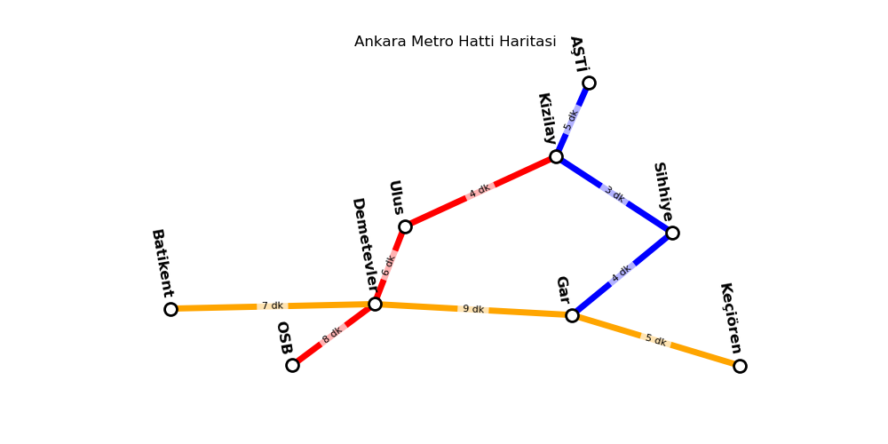

# Global AI Hub - Akbank Python ile Yapay Zekaya Giriş Bootcamp 
# Sürcüsüz Metro Simülasyonu (Rota Optimizasyonu)
Bu proje, Global AI Hub - Akbank Python ile Yapay Zekaya Giriş Bootcamp kapsamında bir bitirme ödevi olarak geliştirilmiştir. Projede amaç, bir metro ağında en hızlı ve en az aktarmalı rotayı bulan bir simülasyon oluşturmaktır. BFS (Breadth-First Search) algoritması ile en az aktarmalı rotayı, A* algoritması ile ise en hızlı rotayı hesaplamaktadır.

Ayrıca, metro ağının görselleştirilmesi için bir grafik arayüzü sunulmuştur.



## 🧠Kullanılan Teknolojiler ve Kütüphaneler
* **Python 3.x:** Proje, Python programlama dili kullanılarak geliştirilmiştir.
* **heapq:** A* algoritmasında öncelik kuyruğu (priority queue) oluşturmak için kullanılmıştır.
* **collections.deque:** BFS algoritmasında kuyruk yapısını oluşturmak için kullanılmıştır.
* **matplotlib & networkx:** Metro ağının görselleştirilmesi için kullanılmıştır.

## 🛠️ Algoritmaların Çalışma Mantığı

### 🔍 BFS (En Az Aktarmalı Rota Bulma)

BFS, bir graf üzerinde en kısa yolu bulmak için kullanılan genişlik öncelikli bir arama algoritmasıdır. Algoritmanın çalışma mantığı şu şekildedir:

1. Başlangıç istasyonu bir kuyruğa eklenir.
2. Ziyaret edilen istasyonlar bir kümede saklanır.
3. Kuyrukta bir istasyon kaldığı sürece:
   * Mevcut istasyon kuyruğun başından çıkarılır.
   * Komşu istasyonlar kontrol edilir.
   * Eğer hedef istasyon bulunduysa, en kısa rota elde edilir.
     
```python
from collections import deque
def en_az_aktarma_bul(self, baslangic_id: str, hedef_id: str) -> Optional[List[Istasyon]]:
    """
    BFS algoritması kullanarak en az aktarmalı rotayı bulur.

    Args:
        baslangic_id (str): Başlangıç istasyonunun benzersiz tanımlayıcısı.
        hedef_id (str): Hedef istasyonunun benzersiz tanımlayıcısı.

    Returns:
        Optional[List[Istasyon]]: Eğer rota bulunursa, başlangıçtan hedefe olan en az aktarmalı rotayı 
                                  (Istasyon listesini) döndürür; rota bulunamazsa None döndürür.
    """
    # Başlangıç veya hedef istasyon bulunamazsa, None döndür.
    if baslangic_id not in self.istasyonlar or hedef_id not in self.istasyonlar:
        return None

    # Başlangıç ve hedef istasyonlarını al.
    baslangic = self.istasyonlar[baslangic_id]
    hedef = self.istasyonlar[hedef_id]

    # Ziyaret edilen istasyonları takip etmek için bir set oluştur.
    ziyaret_edildi = {baslangic}
    
    # BFS için kuyruk oluştur; her eleman (istasyon, o ana kadar izlenen rota) şeklindedir.
    kuyruk = deque([(baslangic, [baslangic])])
    
    while kuyruk:
        # Kuyruğun başındaki istasyon ve rota bilgilerini çıkar.
        istasyon, rota = kuyruk.popleft()
        
        # Hedefe ulaşıldıysa, rota döndürülür.
        if istasyon.idx == hedef.idx:
            return rota

        # Mevcut istasyonun komşularını kontrol et.
        for komsu_istasyon, _ in istasyon.komsular:
            if komsu_istasyon not in ziyaret_edildi:
                ziyaret_edildi.add(komsu_istasyon)
                kuyruk.append((komsu_istasyon, rota + [komsu_istasyon]))
    
    # Eğer tüm istasyonlar ziyaret edilip rota bulunamadıysa, None döndür.
    return None
```

### ⚡A* (En Hızlı Rota Bulma)

A* algoritması, en kısa yolu bulmak için öncelik kuyruğu kullanarak çalışan bir sezgisel (heuristic) arama algoritmasıdır. Çalışma mantığı şu şekildedir:

1. Başlangıç istasyonu öncelik kuyruğuna eklenir.
2. Her istasyon için toplam süre (g maliyeti) ve tahmini kalan süre (h maliyeti) hesaplanır.
3. Her adımda en düşük maliyetli düğüm seçilir.
4. Hedef istasyona ulaşana kadar süreç devam eder.

```python
def en_hizli_rota_bul(self, baslangic_id: str, hedef_id: str) -> Optional[Tuple[List[Istasyon], int]]:
    """
    A* algoritması kullanarak en hızlı rotayı bulur.

    Args:
        baslangic_id (str): Başlangıç istasyonunun benzersiz tanımlayıcısı.
        hedef_id (str): Hedef istasyonunun benzersiz tanımlayıcısı.

    Returns:
        Optional[Tuple[List[Istasyon], int]]: Eğer rota bulunursa, başlangıçtan hedefe olan en hızlı rotayı 
                                              (Istasyon listesini) ve toplam süreyi içeren bir tuple döndürür; 
                                              rota bulunamazsa None döndürür.
    """
    # Başlangıç veya hedef istasyon bulunamazsa, None döndür.
    if baslangic_id not in self.istasyonlar or hedef_id not in self.istasyonlar:
        return None

    # Başlangıç ve hedef istasyonlarını al.
    baslangic = self.istasyonlar[baslangic_id]
    hedef = self.istasyonlar[hedef_id]
    
    # Ziyaret edilen istasyonları takip etmek için bir set oluştur.
    ziyaret_edildi = set()
    
    # A* algoritması için öncelik kuyruğu oluştur; her eleman (süre, id, istasyon, rota) şeklindedir.
    pq = [(0, id(baslangic), baslangic, [baslangic])]  # (süre, id, istasyon, rota)
    
    while pq:
        # Kuyruğun başındaki elemanı çıkar
        sure, idx, istasyon, rota = heapq.heappop(pq)
        
        # Hedef istasyonuna ulaşılmışsa, rota ve süreyi döndür.
        if istasyon.idx == hedef.idx:
            return rota + [istasyon], sure

        # Eğer istasyon zaten ziyaret edildiyse, devam et.
        if istasyon in ziyaret_edildi:
            continue

        # Mevcut istasyonu ziyaret edilmiş olarak işaretle.
        ziyaret_edildi.add(istasyon)

        # Mevcut istasyonun komşularını keşfet.
        for komsu_istasyon, komsu_gecis_sure in istasyon.komsular:
            toplam_sure = sure + komsu_gecis_sure
            # Kuyruğa yeni komşu istasyonu ekle.
            heapq.heappush(pq, (toplam_sure, id(komsu_istasyon), komsu_istasyon, rota + [istasyon]))

    # Eğer tüm istasyonlar ziyaret edilip rota bulunamadıysa, None döndür.
    return None
```

### ❓Neden BFS ve A* Kullanıldı?
* BFS, her adımı eşit maliyetli kabul ettiği için en az aktarmalı rotayı bulmada en etkili yöntemdir.
* A* algoritması, en hızlı rotayı bulmak için sezgisel bir yaklaşım sunarak, tahmini mesafeleri göz önünde bulundurur.

## 📝Örnek Kullanım ve Test Sonuçları
Projenin nasıl çalıştığını görmek için aşağıdaki adımları takip edebilirsiniz:
### Kodun Çalıştırılması:
   ```python
   python EmreSarac_MetroSimulation.py
   ```
### Örnek Metro Ağı:
   * Metro durakları arasındaki mesafeler rastgele atanmıştır.
   ```python
   metro.goruntule(True)
   def goruntule(self, istasyon_bilgileri: bool):
   """
   Tüm hatlardaki istasyonları ve istasyon bilgilerini görüntüler.
   Args:
        istasyon_bilgileri (bool): Eğer True ise, her istasyonun adı ve idx'si görüntülenir. 
                                 Eğer False ise, sadece hat bilgisi görüntülenir.
   Returns:
        None: Bu fonksiyon herhangi bir değer döndürmez, sadece çıktıyı ekrana yazdırır.
    """
    for hat, istasyonlar in self.hatlar.items():
        print(f"Hat: {hat}")
        if istasyon_bilgileri:
            for istasyon in istasyonlar:
                print(f"  - {istasyon.ad} ({istasyon.idx})")
        print()
   ```
   Çıktı:
   ```
    Hat: Kirmizi Hat
      - Kizilay (K1)
      - Ulus (K2)
      - Demetevler (K3)
      - OSB (K4)

    Hat: Mavi Hat
      - AŞTİ (M1)
      - Kizilay (M2)
      - Sihhiye (M3)
      - Gar (M4)

    Hat: Turuncu Hat
      - Batikent (T1)
      - Demetevler (T2)
      - Gar (T3)
      - Keçiören (T4)
   ```
### Test Sonuçları:
   ```python
   # Senaryo 1: AŞTİ'den OSB'ye
    print("\n1. AŞTİ'den OSB'ye:")
    rota = metro.en_az_aktarma_bul("M1", "K4")
    if rota:
        print("En az aktarmali rota:", " -> ".join(i.ad for i in rota))
    
    sonuc = metro.en_hizli_rota_bul("M1", "K4")
    if sonuc:
        rota, sure = sonuc
        print(f"En hizli rota ({sure} dakika):", " -> ".join(i.ad for i in rota))
    
    # Senaryo 2: Batikent'ten Keçiören'e
    print("\n2. Batikent'ten Keçiören'e:")
    rota = metro.en_az_aktarma_bul("T1", "T4")
    if rota:
        print("En az aktarmali rota:", " -> ".join(i.ad for i in rota))
    
    sonuc = metro.en_hizli_rota_bul("T1", "T4")
    if sonuc:
        rota, sure = sonuc
        print(f"En hizli rota ({sure} dakika):", " -> ".join(i.ad for i in rota))
    
    # Senaryo 3: Keçiören'den AŞTİ'ye
    print("\n3. Keçiören'den AŞTİ'ye:")
    rota = metro.en_az_aktarma_bul("T4", "M1")
    if rota:
        print("En az aktarmali rota:", " -> ".join(i.ad for i in rota))
    
    sonuc = metro.en_hizli_rota_bul("T4", "M1")
    if sonuc:
        rota, sure = sonuc
        print(f"En hizli rota ({sure} dakika):", " -> ".join(i.ad for i in rota)) 
   ```
   Çıktı:
   ```
   === Test Senaryolari ===

   1. AŞTİ'den OSB'ye:
   En az aktarmali rota: AŞTİ -> Kizilay -> Kizilay -> Ulus -> Demetevler -> OSB
   En hizli rota (25 dakika): AŞTİ -> AŞTİ -> Kizilay -> Kizilay -> Ulus -> Demetevler -> OSB

   2. Batikent'ten Keçiören'e:
   En az aktarmali rota: Batikent -> Demetevler -> Gar -> Keçiören
   En hizli rota (21 dakika): Batikent -> Batikent -> Demetevler -> Gar -> Keçiören
   
   3. Keçiören'den AŞTİ'ye:
   En az aktarmali rota: Keçiören -> Gar -> Gar -> Sihhiye -> Kizilay -> AŞTİ
   En hizli rota (19 dakika): Keçiören -> Keçiören -> Gar -> Gar -> Sihhiye -> Kizilay -> AŞTİ
   ```
### Görselleştirme:
Bu projede, networkx ve matplotlib kütüphaneleri kullanılarak kullanıcıların ağı daha iyi anlayabilmesi ve simülasyonun nasıl çalıştığını görsel olarak takip edebilmesi için metro ağı görselleştirildi.
* `Networkx`: Metro hatlarını ve duraklarını bir grafik (graph) şeklinde modellemek için kullanıldı. Her bir istasyon bir düğüm (node), her bir bağlantı ise bir kenar (edge) olarak tanımlandı. Bu grafik yapısı, metro hatları arasındaki ilişkileri ve geçiş noktalarını görselleştirmek için temel oluşturuyor.
* `Matplotlib`: Görselleştirme için kullanılan popüler bir kütüphanedir. Bu kütüphane ile networkx tarafından oluşturulan grafiği çizmek için kullanıldı. Duraklar (düğümler) ve bağlantılar (kenarlar) matplotlib ile görselleştirildi ve bir metro ağı haritası oluşturuldu.
* Görselleştirme adımları şu şekilde gerçekleşti:
  1. **Metro Ağı Oluşturma:** networkx kullanarak metro hatlarının ve duraklarının bir ağ yapısında tanımlanması sağlandı.
  2. **Ağ Yapısının Çizimi:** networkx'in sağladığı fonksiyonlar ile bu ağı bir düğüm-kenar şeklinde çizdik.
  3. **Ağı Görselleştirme:** matplotlib kullanarak ağı daha görsel hale getirdik. Duraklar birer nokta olarak, bağlantılar ise çizgilerle gösterildi.
  4. **Etiketlerin konumu:** Grafik üzerinde yazıların daha estetik gözükmesi için, istasyon isimlerinin yazı açılarını (angle) değiştirdik. Bu, özellikle sıkışık veya üst üste binen metinleri daha okunabilir hale getirir. matplotlib'in rotate parametresi kullanılarak her bir yazı (etiket) farklı açılarda yerleştirildi.

## 🚀Projeyi Geliştirme Fikirleri
* Gerçek Dünya Verileri ile Entegrasyon: İstanbul metrosunun gerçek verileri kullanılarak daha gerçekçi bir simülasyon yapılabilir.
* Farklı Algoritmaların Eklenmesi: Dijkstra veya Floyd-Warshall gibi algoritmalar eklenerek alternatif çözümler sunulabilir.
* Mobil veya Web Arayüzü: Kullanıcı dostu bir arayüz eklenerek, kullanıcıların başlangıç ve hedef noktalarını seçerek en iyi rotayı görmesi sağlanabilir.

## 👤 Credits / Author
* Emre Saraç
  <e.sarac@outlook.com>

---
**Bug reports, feature requests and pull requests are always welcome** 

